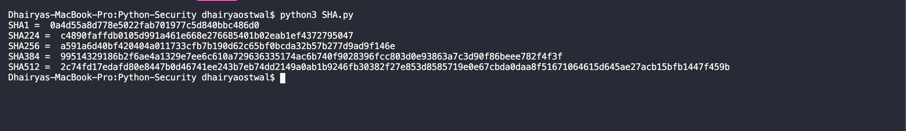

# Encryption Methods

## ✅ Caesar Cipher or ROT13

* ROT13 aka "Rotate by 13"
* **Why 13?** Because of 13 being mid of 26 alphabets and hence easy to encrypt and decrypt. Similarly for ROT5 for 0-9 numeric characters
* Very simple and easily crackable via frequency analysis

## ✅ AES Encryption

* **Requirement:** `Crypto.Cipher` module
* **Remark:** Key & Message both must be 16, 24 or 32 bit long. 

```

Example: 
Key = '0123456789012345'
Message = 'Dhairya Rockstar'        

```

## ✅ Hashing

* **Requirement:** `Hashlib` module
* **NOTE:** Message to be encrypted should be entered in byte format, example: `md5.update(b'Sample Text')`
* Two important functions: 
    1. `digest()` : Encrypt in byte format
    2. `hexdigest()` : Encrypt in hexadecimal format. More secured than `digest()`

## ✅ SHA

* Different types `SHA` 
* **Increasing complexities** -> `sha1` <  `sha256` < `sha512`



## ✅ Blocksize & Digestsize

`block_size` and `digest_size` functions

## ✅ Shake Algo.

* **Important** to specify `.digest(value)`

## ✅ Salting

* Done so as to avoid brute force crack and done to provide **more security**

## ✅ RIPEMD_160


**Star the repo ⭐️ if you like 😄**

## Before you leave 🥺

Let's connect on 

[](https://www.linkedin.com/in/dhairyaostwal/) [](https://www.instagram.com/dhairyaostwal/) [](https://medium.com/@dhairyaostwal)
